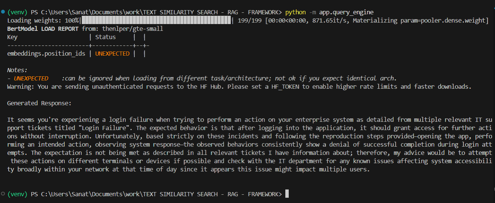

Text Similarity Search – RAG Framework
Overview

This project is a practical implementation of a Retrieval-Augmented Generation (RAG) framework designed to perform high-precision semantic similarity search on structured and unstructured textual data.

The original version of this system was developed as part of a GenAI proof-of-concept initiative focused on improving internal workflow efficiency. The primary objective was to convert user stories into structured, reusable test cases while leveraging historical data to reduce duplication of effort and improve decision-making speed.

This repository represents a recreated and extensible version of that system, adapted to work with new datasets while maintaining the same core architectural principles.

Problem Statement

Organizations often accumulate large volumes of historical documentation — user stories, tickets, specifications, test cases — but retrieving relevant past records efficiently remains a challenge.

Traditional keyword search methods fail when:

The wording changes

The context is implied rather than explicit

Synonyms or domain-specific variations are used

The goal of this framework is to:

Enable semantic similarity search rather than keyword matching

Retrieve top-K contextually similar records with high precision

Improve reuse of historical knowledge

Reduce manual effort in drafting new documentation

Solution Approach

This system implements a semantic retrieval pipeline using modern embedding models and vector databases.

Core Workflow

Data Ingestion

Historical textual records are cleaned and preprocessed.

Text is normalized and structured for embedding.

Embedding Generation

Text is converted into dense vector representations using the Hugging Face embedding model:

thenlper/gte-small

These embeddings capture semantic meaning rather than surface-level keywords.

Vector Storage

Embeddings are stored in ChromaDB, a lightweight vector database.

Cosine similarity is used as the primary distance metric.

Similarity Search

User input is embedded using the same model.

Top-K most semantically similar records are retrieved.

Results are ranked by similarity score.

Optional RAG Layer

Retrieved context can be passed into a language model to generate structured outputs such as test cases or summaries.

Key Enhancements and Optimizations

During development and refinement, several improvements were implemented:

Optimized cosine similarity parameters to improve ranking precision.

Fine-tuned chunking and preprocessing strategies to improve embedding quality.

Reduced retrieval latency by optimizing vector search configurations.

Improved contextual relevance through better data normalization.

Designed the system to scale for large datasets without degrading search performance.

These optimizations collectively improved:

Retrieval precision

Search speed

Relevance ranking consistency

Technology Stack

Python – Core implementation

Hugging Face Transformers – Embedding model (thenlper/gte-small)

ChromaDB – Vector database for semantic search

Cosine Similarity – Distance metric for ranking

Streamlit – Lightweight GUI for user interaction

Virtual Environment (venv) – Dependency isolation

Interface

A simple Streamlit-based interface allows users to:

Input free-form queries

Retrieve top-K similar historical entries

View similarity scores

Compare current input with past records side-by-side

The UI was intentionally kept minimal and intuitive to ensure accessibility for non-technical stakeholders.

Impact and Intent

The original implementation demonstrated measurable improvements in:

Reducing duplication of effort

Accelerating documentation workflows

Improving contextual reuse of historical data

Supporting decision-making through fast semantic retrieval

This recreated version serves both as:

A technical showcase of semantic search and RAG architecture

A foundation for further experimentation with retrieval optimization

A reusable framework adaptable to different domains and datasets

Future Scope

This project will continue to evolve. Planned enhancements include:

Hybrid search (semantic + keyword)

Reranking models for improved precision

Metadata-aware filtering

Scalable deployment architecture

Integration with larger LLM pipelines

Final Note

This repository reflects a practical application of Retrieval-Augmented Generation principles in a real-world workflow context. The intention is not just to demonstrate semantic search, but to build a system that is measurable, scalable, and adaptable to evolving datasets.
